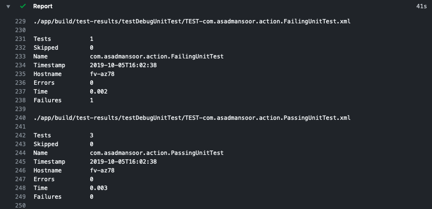

# Android Test Report Action
GitHub Action that prints Android test xml reports.

## Usage

The Android Test Report action parses the xml reports produced by the tests and outputs data for all test suites.

```yml
name: Android CI
on: [push]

jobs:
  # Execute unit testing command
  test:
    runs-on: ubuntu-latest
    steps:
    - uses: actions/checkout@v1

    - name: set up JDK 1.8
      uses: actions/setup-java@v1
      with:
        java-version: 1.8

    - name: Unit Test
      run: ./gradlew testDebugUnitTest
      continue-on-error: true # Allow steps to continue even with test failures

    - name: Report
      uses: asadmansr/android-test-report-action@master
```

## Output

